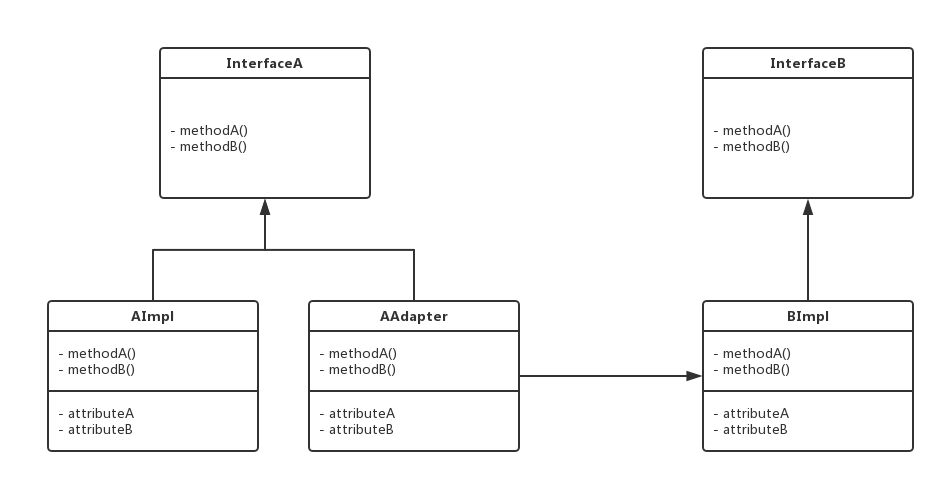

### 适配器模式（Adapter）

> 现在有这样一个场景，由于历史遗留问题，有两个功能类似的接口，但是你只能对外暴露一个接口，而且两个接口的功能都要用到。

适配器模式主要是希望复用一些现存的类。两个功能类似但实现不同接口的类，应用适配器模式可以达到对客户端统一。



包结构：

```
- adapter
  - impl  
    - AAdapter.java    
    - AImpl.java  
    - BImpl.java
  - InterfaceA.java
  - InterfaceB.java
  - AdapterTest.java
```

代码：

```
//接口A
public interface InterfaceA {
    void methodA();
    void methodB();
}
```

```
//接口B
public interface InterfaceB {
    void methodA();
    void methodB();
}
```

```
//接口A的实现类
public class AImpl implements InterfaceA {
    @Override
    public void methodA() {
        System.out.println("I'm AImpl's methodA");
    }

    @Override
    public void methodB() {
        System.out.println("I'm AImpl's methodB");
    }
}
```

```
//接口B的实现类
public class BImpl implements InterfaceB {
    @Override
    public void methodA() {
        System.out.println("I'm BImpl's methodA");
    }

    @Override
    public void methodB() {
        System.out.println("I'm BImpl's methodB");
    }
}
```

```
//接口A对接口B的适配器类
public class AAdapter implements InterfaceA {

    private BImpl bImpl = new BImpl();

    @Override
    public void methodA() {
        bImpl.methodA();
    }

    @Override
    public void methodB() {
        bImpl.methodB();
    }
}
```

测试：只需对外暴露InterfaceA

```
public class AdapterTest {

    public static void main(String[] args) {
        InterfaceA a = new AImpl();
        a.methodA();
        a.methodB();

        InterfaceA b = new AAdapter();
        b.methodA();
        b.methodB();
    }
}
```

输出结果：

```
I'm AImpl's methodA
I'm AImpl's methodB
I'm BImpl's methodA
I'm BImpl's methodB
```
